# AppInit Binary Distribution Architecture

## Overview

The AppInit binary distribution system provides a scalable, serverless solution for distributing Go binaries across multiple platforms and architectures. Users can download platform-specific binaries or use an automated install script.

## Architecture Diagram

```mermaid
graph TD
    %% Users
    USER[👤 End Users<br/>curl install script]
    
    %% Main flow
    USER -->|HTTPS Request| API[🌐 API Gateway<br/>3 endpoints: /list, /download, /install]
    
    API -->|Route requests| LAMBDA[⚡ Lambda Functions<br/>List binaries<br/>Generate download URLs<br/>Return install script]
    
    LAMBDA -->|Read/Generate URLs| S3[🪣 S3 Bucket<br/>Binary Storage<br/>Linux amd64/arm64<br/>macOS amd64/arm64<br/>Windows amd64]
    
    %% Supporting services
    LAMBDA -.->|Logs| LOGS[📊 CloudWatch Logs]
    
    %% Resource grouping
    subgraph RG ["Resource Group: AppInit-BinaryDistribution"]
        API
        LAMBDA
        S3
        LOGS
    end
    
    %% CI/CD Automation
    DEV[👨‍💻 Developer] -->|Push/PR| GITHUB[🔄 GitHub Actions<br/>Automated CI/CD]
    GITHUB -->|Build & Deploy| S3
    
    %% Manual Deployment
    DEV -.->|Manual Deploy| CDK[🏗️ AWS CDK]
    CDK -.->|Creates| API
    CDK -.->|Creates| LAMBDA
    CDK -.->|Creates| S3

    %% Styling
    classDef primary fill:#FF9900,stroke:#232F3E,stroke-width:3px,color:#fff
    classDef secondary fill:#3F8FBF,stroke:#232F3E,stroke-width:2px,color:#fff
    classDef user fill:#4CAF50,stroke:#232F3E,stroke-width:2px,color:#fff
    classDef dev fill:#9C27B0,stroke:#232F3E,stroke-width:2px,color:#fff

    class API,LAMBDA primary
    class S3,LOGS secondary
    class USER user
    class DEV,CDK,GITHUB dev
```



## Components

### 1. API Gateway
- **Purpose**: REST API endpoint for binary distribution
- **Endpoints**:
  - `GET /list` - Lists available binaries
  - `GET /download?platform=<os>&arch=<arch>` - Downloads specific binary
  - `GET /install` - Returns platform-detection install script

### 2. Lambda Functions
- **ListHandler**: Returns JSON list of available binaries with metadata
- **DownloadHandler**: Generates presigned S3 URLs for binary downloads
- **InstallHandler**: Returns shell script that auto-detects platform and installs binary

### 3. S3 Bucket
- **Name**: `appinit-binaries`
- **Purpose**: Stores compiled binaries for all supported platforms
- **Security**: Private bucket with presigned URL access
- **Versioning**: Enabled for binary history

### 4. CloudWatch Logs
- **Purpose**: Centralized logging for all Lambda functions
- **Retention**: Default retention policy
- **Monitoring**: Available for debugging and analytics

### 5. Resource Group
- **Name**: `AppInit-BinaryDistribution`
- **Purpose**: Groups all related resources for easy management
- **Tags**: Consistent tagging across all resources

## Supported Platforms

| Platform | Architecture | Binary Name |
|----------|-------------|-------------|
| Linux    | AMD64       | `appinit-linux-amd64` |
| Linux    | ARM64       | `appinit-linux-arm64` |
| macOS    | AMD64       | `appinit-darwin-amd64` |
| macOS    | ARM64       | `appinit-darwin-arm64` |
| Windows  | AMD64       | `appinit-windows-amd64.exe` |

## Usage Instructions

### For End Users

#### Quick Install (Recommended)
```bash
curl -sSL https://kkklfsac6b.execute-api.us-east-1.amazonaws.com/prod/install | bash
```

#### Manual Download
```bash
# List available binaries
curl https://kkklfsac6b.execute-api.us-east-1.amazonaws.com/prod/list

# Download specific binary
curl -L "https://kkklfsac6b.execute-api.us-east-1.amazonaws.com/prod/download?platform=darwin&arch=amd64" -o appinit
chmod +x appinit
```

### For Developers/Maintainers

#### Automated Deployment (Recommended)
Binaries are automatically built and deployed via GitHub Actions on every commit to main or merged PR. No manual intervention required.

#### Manual Deployment (If Needed)

**Prerequisites:**
- AWS CLI configured with appropriate permissions
- Node.js (for CDK)
- Python 3.11+ with uv
- Go 1.21+ (for building binaries)

**Deploy Infrastructure:**
```bash
cd infra
export CDK_DEFAULT_ACCOUNT=<your-account-id>
export CDK_DEFAULT_REGION=us-east-1
uv run cdk deploy --require-approval never
```

**Build and Upload Binaries:**
```bash
cd infra
uv run python scripts/build_and_deploy.py
```

**Tear Down Resources:**
```bash
cd infra
uv run cdk destroy --force
```

## Cost Analysis

### Monthly Cost Breakdown (Estimated)

#### Base Infrastructure (Always Running)
- **S3 Storage**: ~$0.15/month
  - 5 binaries × ~4MB each = 20MB
  - Standard storage: $0.023/GB/month
- **API Gateway**: $0.00 (first 1M requests free)
- **Lambda**: $0.00 (first 1M requests + 400,000 GB-seconds free)
- **CloudWatch Logs**: ~$0.50/month (minimal logging)

**Base Monthly Cost: ~$0.65/month**

#### Usage-Based Costs (Per 1,000 Downloads)
- **API Gateway**: $0.0035 (after free tier)
- **Lambda Invocations**: $0.0002
- **Lambda Duration**: ~$0.0001 (100ms average)
- **S3 Requests**: $0.0004 (GET requests)
- **Data Transfer**: $0.09 (assuming 4MB average × 1,000 downloads)

**Cost per 1,000 downloads: ~$0.09**

#### Scaling Estimates

| Monthly Downloads | Monthly Cost |
|------------------|--------------|
| 0 - 1,000        | $0.65 - $0.74 |
| 10,000           | $1.55 |
| 100,000          | $9.65 |
| 1,000,000        | $90.65 |

### Cost Optimization Notes

1. **Free Tier Benefits**: First year includes significant free tier usage
2. **S3 Intelligent Tiering**: Could reduce storage costs for infrequently accessed binaries
3. **CloudFront**: Adding CDN would reduce data transfer costs for global users
4. **Reserved Capacity**: Not applicable for serverless components

### Cost Monitoring

- Set up AWS Budgets for cost alerts
- Monitor usage through CloudWatch metrics
- Use AWS Cost Explorer for detailed analysis
- Resource Group provides centralized cost tracking

## Security Considerations

- S3 bucket is private with presigned URL access
- Lambda functions have minimal IAM permissions
- API Gateway has no authentication (public download service)
- All resources are tagged for compliance and cost tracking
- CloudTrail integration available for audit logging

## CI/CD Automation

The system includes automated deployment via GitHub Actions:

- **Trigger**: Commits to main branch or merged PRs
- **Process**: Builds Go binaries for all platforms, uploads to S3
- **Authentication**: Uses AWS OIDC for secure, keyless deployment
- **Monitoring**: GitHub Actions provides build status and logs

## Monitoring and Maintenance

- **CloudWatch Logs**: Lambda function debugging and monitoring
- **API Gateway Metrics**: Request volume and latency tracking
- **S3 Metrics**: Storage usage and transfer monitoring
- **Resource Group**: Centralized resource management in AWS Console
- **GitHub Actions**: Automated deployment status and history
- **CDK**: Infrastructure as code with version control